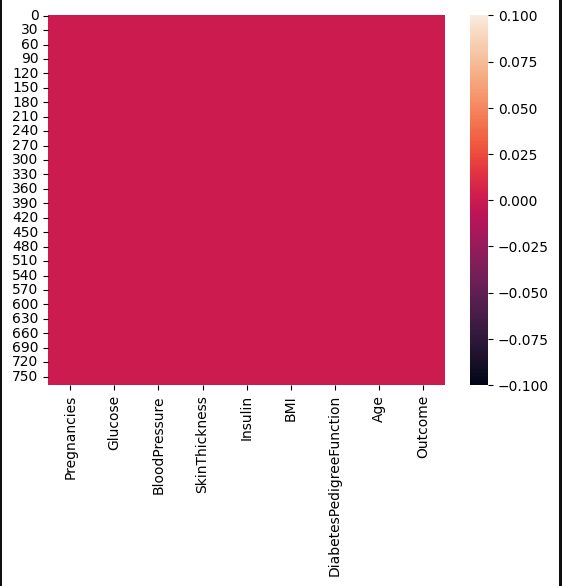
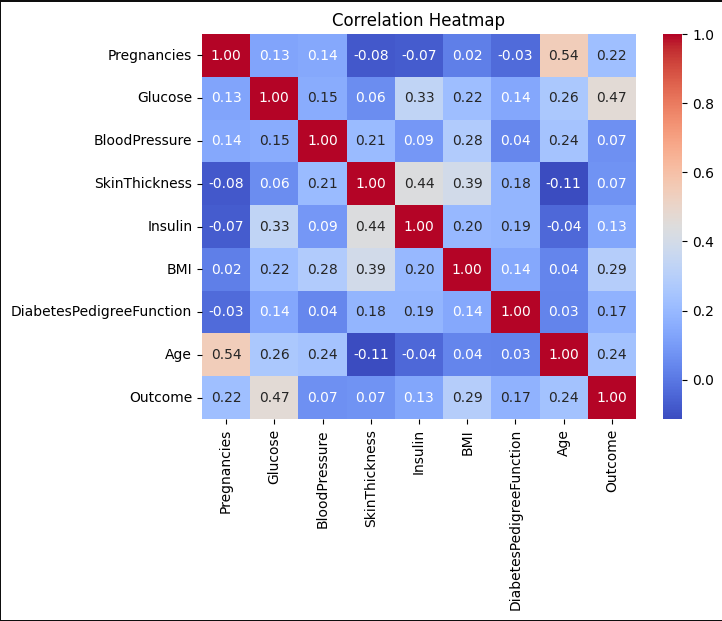
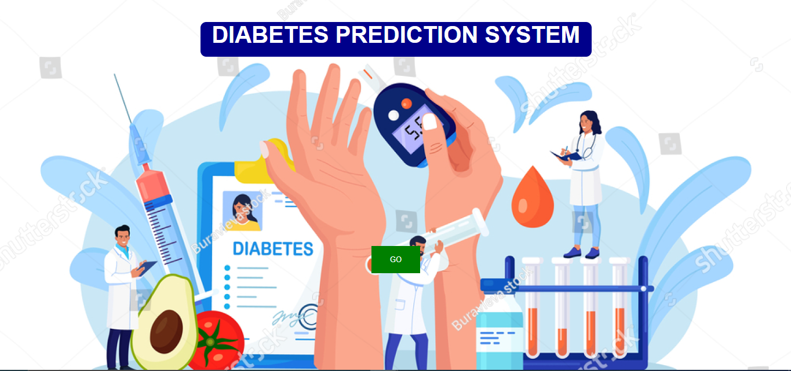
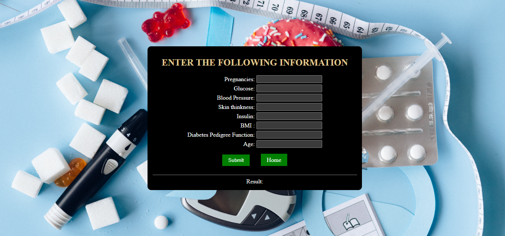

# Diabetes Prediction for patients

## Overview

Hre is the source code and documentation for ***Diabetes Prediction System for patients*** created using Python. The prediction model provides healthcare solution to predict a patient is diabetic(Positive) or non-diabetic(Negative) as shown in below demo.

## Project Demo

<p align="center">

</p>

## Table of Contents

- [Introduction](#introduction)
- [Key Achievements](#key-achievements)
- [Methodology](#methodology)
- [Tools and Framewor](#tools-and-framework)
- [EDA Process](#exploratory-data-analysis-eda-process)
- [Results](#results)
- [Diabetes Prediction System](#diabetes-prediction-system)
- [Installation](#installation)
- [Web App Preview](#web-app-preview)
- [Data Source](#data-source)


## Introduction

In this project the dataset, sourced from the National Institute of Diabetes and Digestive and Kidney Diseases, is designed to achieve the diagnostic prediction of diabetes in patients. It leverages specific diagnostic measurements contained within the dataset to make these predictions.

## Key Achievements

### Data Exploration : 
- Started with dataset in (.csv) format, which comprised several variables, including multiple independent medical predictor variables, and a single target dependent variable called 'Outcome'.

### Identifying Predictive Potential: 
- Upon examination, identified the dataset's potential for predictive analysis. Predictive analysis, in essence, involves forecasting future trends and behaviours.

### Data Segmentation: 
- To unlock predictive insights, partitioned the dataset into two categories - independent variables and the dependent variable. Analysis revealed that all 8 variables out of 9, namely **'Pregnancies', 'Glucose,' 'Blood Pressure', 'Skin Thickness', 'Insulin', 'BMI', 'Diabetes'** and **'Age'** function as independent variables. Meanwhile, **'Outcome'** emerged as the dependent variable.

### Interpretation of 'Outcome': 
- Within the dataset, '0' signifies that a person is not diabetic, while '1' indicates that the individual has diabetes.

## Methodology
- I have applied ***Logistic Regression*** (Method for predicting the probability of a binary outcome using the logistic function) Machine Learning algorithm to build the prediction model. And I have also built a **"Diabetes Prediction System"** web app with the model to predict diabetes by providing medical information. 

## Tools and Framework
 - Python Libraries (Pandas, Numpy, Seaborn, Scikit-learn, Matplotlib)
 - Jupyter Notebook
 - Django (for web app)
 - VS Code editor

## Exploratory Data Analysis (EDA) Process

- Data cleaning, handling missing value
- Chec relationship between variables using co-relation matrix
- Calculate statistical measurement
- Train the model and make prediction
- Evaluate the performance by accuracy score metrics

## Results

<p align="center">

</p>

---

<p align="center">

</p>

## Diabetes Prediction System

<p align="center">

</p>

## Installation

To install this prediction system into your local system to use, follow below steps:

- Step 1: clone the repository. Go to *"Diabetes_Prediction"* project folder then move into *"DiabetesPredictionSystem"* folder.

    ```bash
    git clone https://github.com/PuranjoyPatra/MeriSKILL-Internship-Projects.git
    cd Diabetes_Prediction/DiabetesPredictionSystem
    ```
- Step 2: open *"DiabetesPredictionSystem"* folder with VS Code Editor (You can use any editor, but it's recommended). And, Python is also to be installed in your system before if not. 
    + Install Python  -> [Download](https://www.python.org/)
    + Install VS Code  -> [Download](https://code.visualstudio.com/)
    + Install Jupyter Notebook for analysis and show the output instatntly.
        ```python
        #open command prompt or power shell. run following command
        pip install jupyter notebook

        #to open the notebook 
        jupyter notebook
        ```  


- Step 3: Download the dataset (.csv file) from [Data Source](#data-source). From current directory move into *"DiabetesPredictionSystem"* folder, open *"views.py"* file and edit dataset path according to your file location. 
- Step 4: open terminal in VS Code and install python libraries and django as mentioned [Tools and Framework](#tools-and-framework) section. ***(Note: if already installed, you can skip this step)***

    ```python
    #install important python libraries
    pip install numpy
    pip install pandas
    pip install scikit-learn
    pip install matplotlib
    pip install seaborn

    #install django framework
    pip install django
    ```
- Step 5: Run the web app to use

    ```python
    python manage.py runserver
    ```
## Web App Preview

<p align="center">

</p>

---

<p align="center">

</p>

## Data Source

Diabetes dataset as .csv file is provided by @MeriSILL during internship. [Click Here](./diabetes_dataset.csv) to see the dataset. 

