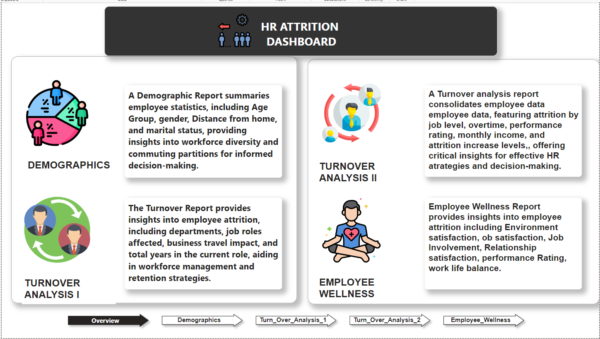
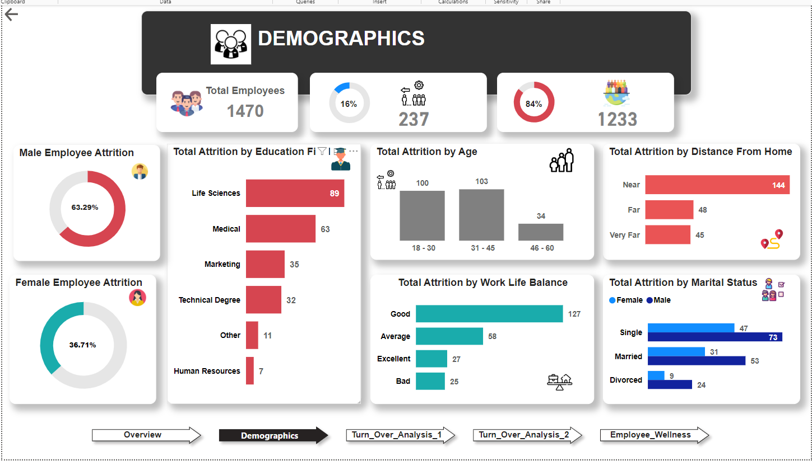
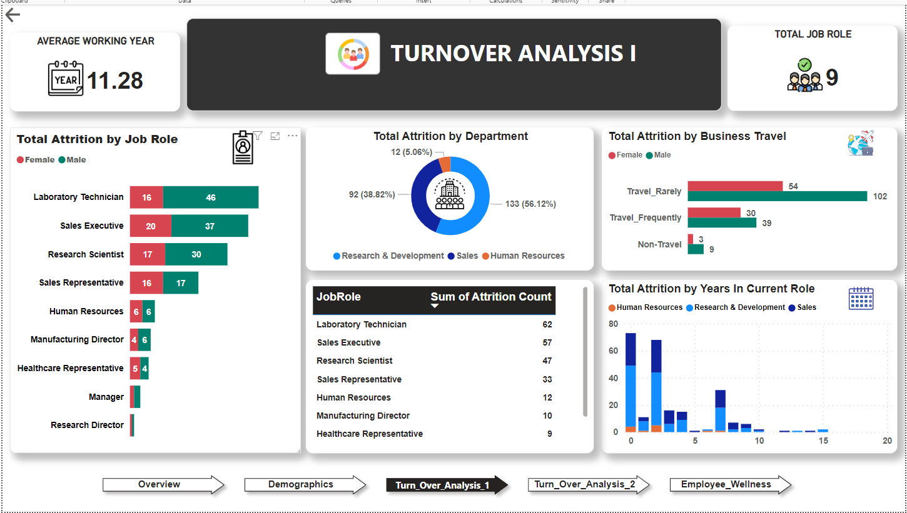
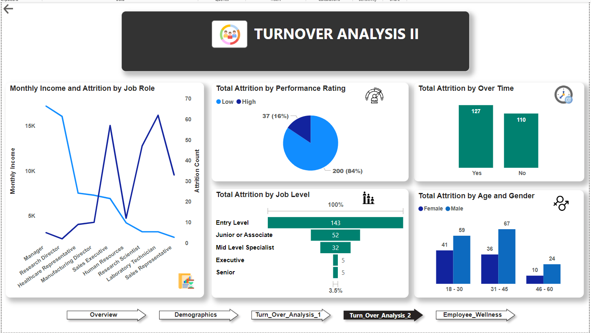
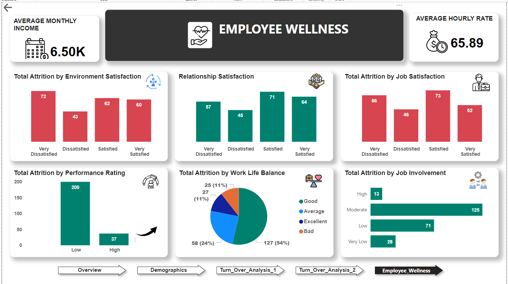

# HR Analytics Dashboard

## Overview

This repository contains the source code and documentation for a ***HR Analytics Dashboard*** created using **Power BI**. The dashboard provides insightful visualizations and analytics to help organization and analyze their employee retention and attrition.

## Project Demo

## Table of Contents

- [Introduction](#introduction)
- [Tools](#tools)
- [ETL Process](#extract-transform-and-load-etl-process)
- [Data Visualization](#data-visualization)
- [KPI](#kpi)
- [Insights and Findings](#insights-and-findings)
- [Features](#features)
- [Dashboard Preview](#dashboard-preview)
- [Data Source](#data-source)

## Introduction

Analyse employee attrition details to enhance organization's ability to attract, retain, nurture top talent and engaged workforce with more productive environment.

## Tools

- Power Bi Desktop -> [Download](https://powerbi.microsoft.com/en-in/desktop/)

## Extract, Transform and Load (ETL) Process
In this project, ETL process involved the following key steps:

### Data Extraction
- Extract and download HR attrition data as .csv file provided by @MeriSKILL during internship.

### Data Transformation

+ Data Cleaning
    - Handling missing values.
    - Removing duplicate and unnecessary values..
    - Standardizing or formatting data types for each column as per required.

+ Data Preprocessing
    - create new column using DAX (Data Analysis Expressions), conditional column formatting as per requirement.
    - create new measure for calculation such as attrition count, active employee, etc.
    - create data groups for analysing and better outcomes. for example: age group, salary slab, eyc.

### Data Loading
- Loaded the transformed data into the Power BI environment for analysis and dashboard creation.

## Data Visualization
Performed various data visualization techniques to uncover patterns, trends, and relationships within the HR Employee Attrition data. The visualizations created during the process include:

- Line charts to visualize monthly income, attrition by job role.
- bar charts. 
- Progress chart using donut charts.
- Stacked column and stacked bar charts.
- advance cards to display KPI values. 
- pie charts, column charts.
- Page Navigation Action feature to navigate between different report page. use *ctrl + click* to navigate. I have applied the action on Images (Overview Page) and Back button "⇦" on other page. kindly, check above demo video for better understanding.
- Matrix view visulas to show attrition count by job roles.

## KPI

The Key Performance Indicator (KPI) are mentioned below:
- Total Employees = 1470
- Total Attrition with Rate = 237 (16%)
- Active Employees = 1233
- AVG Working Year = 11.28
- Total Job Role = 9
- AVG Hourly Rate = 65.89
- AVG Monthly Income = 6.50K

## Insights and Findings

- Employee Attrition by gender: Male - 63.29%, Female - 36.81% 
- Total Attrition by Education Field: Top field - Life Science
- Total Attrition by Age: Highest 31-45 age group 
- Total Attrition by Marital Status - single, married, divorced
- Total Attrition by Job Role: Highest Lab Technician
- Total Attrition by Years in Current Role
- Department & Performance Rating wise Attrition
- Monthly Income and Attrition by Job Role
- Attrition by Job Level and Over Time
- Attrition by Environment, Relationship and Job Satisfaction
- Job Involvement and Work Life Balance wise Attrition

## Features

- Interactive visualizations for sales performance
- Drill-down capabilities for detailed analysis
- Filter options for customized views
- Page navigation

## Dashboard Preview

---

---

---

---

## Data Source

HR Attrition data as .csv file is provided by @MeriSILL during internship. [Click Here](HR-Employee-Attrition.csv) to see the dataset. 

