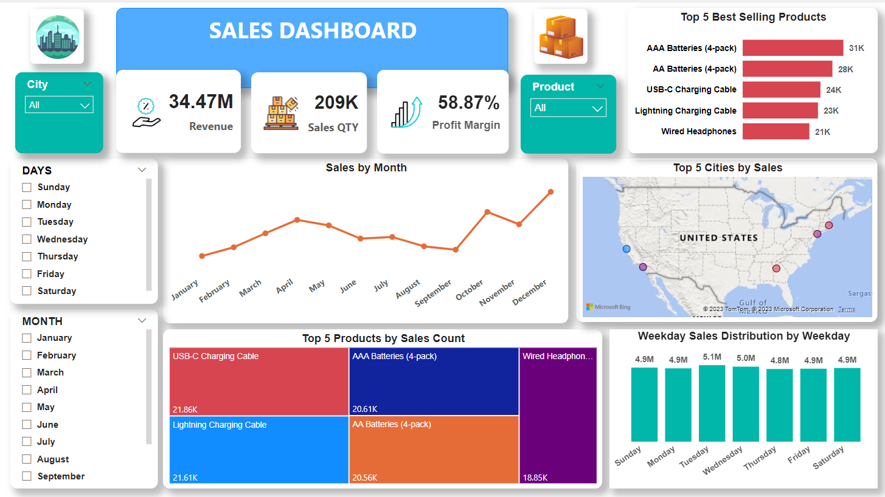

# Sales Data Analysis Dashboard

## Overview

This repository contains the source code and documentation for a Sales Data Analysis Dashboard created using Power BI. The dashboard provides insightful visualizations and analytics to help businesses understand and analyze their sales performance.

## Project Demo

## Table of Contents

- [Introduction](#introduction)
- [Live Dashboard](#live-dashboard)
- [Key Achievements](#key-achievements)
- [Tools](#tools)
- [ETL Process](#extract-transform-and-load-etl-process)
- [Data Visualization](#data-visualization)
- [KPI](#kpi)
- [Insights and Findings](#insights-and-findings)
- [Features](#features)
- [Dashboard Preview](#dashboard-preview)
- [Data Source](#data-source)

## Introduction

Analyse sales data to pinpoint emerging trends, top-performing products, and essential revenue metrics, facilitating informed and strategic business decision-making.

## Live Dashboard

To interact with the dashboard click here 👉🏻 [Live Dashboard](https://app.powerbi.com/view?r=eyJrIjoiMmY4YTdiZDAtOGZkMS00NmRiLTlkZjctNmZmNzBjYjhiMzQyIiwidCI6ImRmODY3OWNkLWE4MGUtNDVkOC05OWFjLWM4M2VkN2ZmOTVhMCJ9)

## Key Achievements

In this project, examine a large sales dataset to extract valuable insights. Explore sales trends over time, identify the best-selling products, calculate revenue metrics such as total sales and profit margins, and create visualizations to present the findings effectively.

## Tools

- Power BI Desktop -> [Download](https://powerbi.microsoft.com/en-in/desktop/)

## Extract, Transform and Load (ETL) Process
In this project, ETL process involved the following key steps:

### Data Extraction
- Extract and download sales data as .csv file provided by @MeriSKILL during internship.

### Data Transformation

+ Data Cleaning
    - Handling missing values.
    - Removing duplicate and unnecessary values..
    - Standardizing or normalizing numerical features.
    - split Date-Time column into two columns date, timestamp and format correctly.

+ Data Preprocessing
    - create new column using DAX (Data Analysis Expressions), conditional column formatting as per requirement. for example: week name from date column using DAX, week name oreder using conditional column to sort week name.
    - create new measure for calculation such as total revenue, profit margin, etc.

+ Data Loading
    - Loaded the transformed data into the Power BI environment for analysis and dashboard creation.

## Data Visualization
Performed various data visualization techniques to uncover patterns, trends, and relationships within the sales data. The visualizations created during the process include:

- Line charts to visualize sales trends over time.
- bar charts to show sales performance by product or category.
- tree map to show top products by sales count.
- map to visualize top cities by sales.
- advance cards to display KPI values. 

## KPI

The Key Performance Indicator (KPI) are mentioned below:
- Total Sales / Revenue = $34.47M
- Sales Quantities = 209K
- Profit Margin = 58.87%

## Insights and Findings

- Sales by Month
- Top 5 best selling products
- Top 5 Cities by Sales
- Top 5 Products by Sales Quantities
- Weekly sales distribution by week days
- column chart for week day sales distribution
- slicers to filter out data accordingly.

## Features

- Interactive visualizations for sales performance
- Drill-down capabilities for detailed analysis
- Filter options for customized views
- Trend analysis and forecasting

## Dashboard Preview

## Data Source

Sales data as .csv file is provided by @MeriSILL during internship. [Click Here](./Sales-Data.csv) to see the dataset. 

